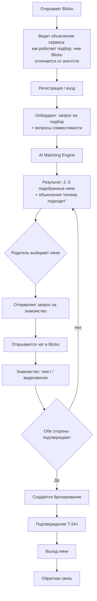
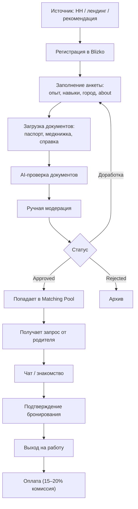
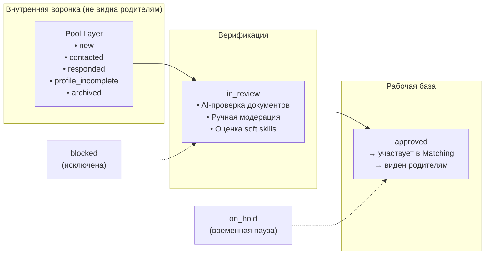
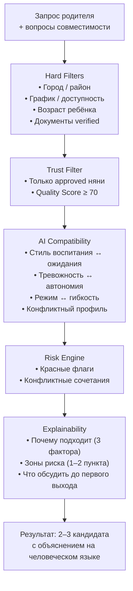
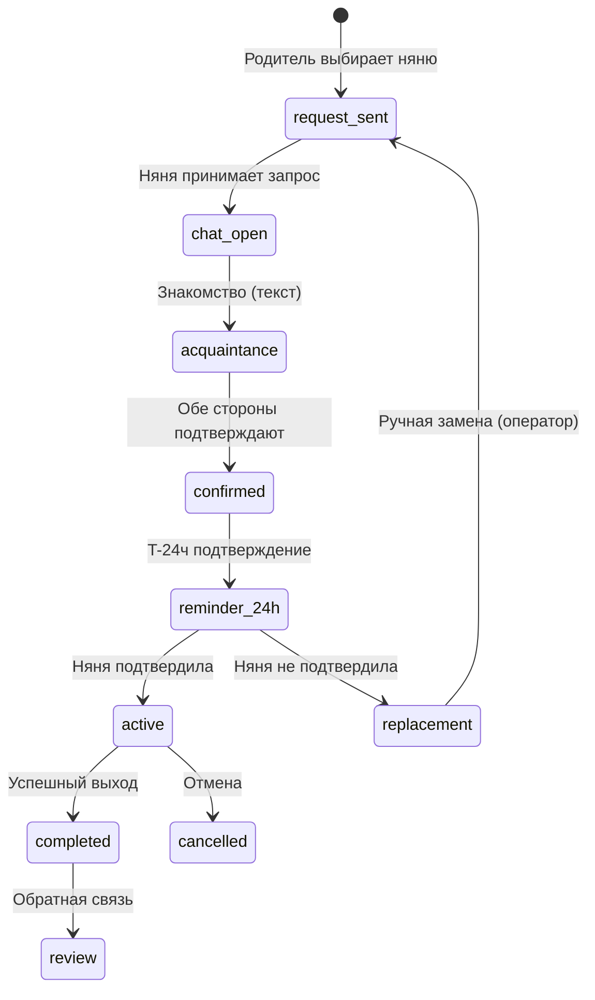

# Blizko — Product Specification v1.0

> Единая продуктовая спецификация. Создана на основе discovery-интервью (2026-03-07).

---

## Executive Summary

Blizko — AI-сервис безопасного подбора нянь, который соединяет семьи с проверенными нянями напрямую, без агентств. Платформа решает три ключевые проблемы рынка: **отсутствие доверия** (родители не знают, кого пускают в дом), **поверхностный подбор** (агентства матчат по 5–10 параметрам, игнорируя совместимость) и **ненадёжность** (няни отменяют, уходят, нарушают договорённости).

Blizko — не каталог нянь, а **интеллектуальный сервис подбора**, где AI объясняет, почему конкретная няня подходит конкретной семье.

---

## Problem Statement

### Что болит у родителей

| Проблема | Текущее решение | Почему не работает |
|----------|-----------------|-------------------|
| Нет доверия к няням | Агентства обещают «проверку» | Проверка непрозрачна, нет системной верификации |
| Поверхностный подбор | Ручной подбор по 5–10 параметрам | Не учитывает совместимость стилей, тревожность, подход к воспитанию |
| Низкая скорость | 3–7 дней через агентство | Родителям часто нужна няня завтра |
| Нет гарантий | Договорённости на словах | Няня может не приехать, отменить, уйти через неделю |
| Плохой UX | WhatsApp, PDF-списки, Word-анкеты | Нет цифрового продукта с прозрачным процессом |

### Что продаёт Blizko

**Не продаёт:** часы работы нянь, трудоустройство, каталог анкет.

**Продаёт:** безопасный, объяснимый AI-подбор нянь, которые действительно подходят семье.

---

## Success Criteria

| Метрика | Определение | Целевое значение (Phase 1) |
|---------|-------------|---------------------------|
| Time to first match | От создания запроса до показа подобранных нянь | < 5 минут |
| Match → Contact | Доля родителей, начавших чат с подобранной няней | > 60% |
| Contact → Booking | Доля чатов, перешедших в бронирование | > 30% |
| Booking → Completed | Доля бронирований, завершившихся успешным выходом | > 85% |
| CSAT (родители) | Удовлетворённость после первого выхода | > 4.0/5.0 |
| Approved nannies | Число верифицированных нянь в активной базе | 50+ для запуска |

---

## User Personas

### 👩 Родитель (Parent)

- **Кто:** Родитель (чаще мама), 25–45 лет, Москва/крупные города
- **Техническая грамотность:** средняя (привычные приложения: Авито, Яндекс.Такси)
- **Мотивация:** быстро найти надёжную няню, которой можно доверять
- **Страхи:** пустить незнакомого человека в дом, няня даст ребёнку лекарства, не соблюдёт договорённости, не приедет
- **Ожидание от сервиса:** прозрачность, объяснимость, скорость, гарантии

### 👩‍🍼 Няня (Nanny)

- **Кто:** Женщина 20–55 лет, опыт ухода за детьми, самозанятая/подрядчик
- **Мотивация:** стабильный поток заказов, адекватные семьи, прозрачные условия
- **Страхи:** неоплата, конфликтные семьи, нечёткие обязанности
- **Ожидание от сервиса:** понятные правила, быстрый выход на заказы, поддержка

---

## User Journeys

### Journey 1: Родитель — от запроса до бронирования

**Success moments (последовательно):**

1. Увидел подобранных нянь + объяснение → *«Blizko понимает мою семью»*
2. Получил сообщение от верифицированной няни → *«Это реально работает»*
3. Няня пришла, всё прошло хорошо → *«Можно доверять»*

### Journey 2: Няня — от отклика до первого заказа

---

## System Architecture

### Модель доверия (Trust Layer)

> [!IMPORTANT]
> **Ключевой принцип:** Родитель видит **только** полностью верифицированных нянь (статус `approved`). Непроверенные няни не участвуют в matching и не отображаются.

#### Что входит в полную верификацию

| Шаг | Метод | Результат |
|-----|-------|-----------|
| Подтверждение личности | Телефон (SMSAero) | Phone verified |
| Паспорт | AI (OCR/MRZ) + ручная проверка | Document verified |
| Медицинская книжка | AI-анализ + ручная проверка | Document verified |
| Справка о несудимости | AI-анализ + ручная проверка | Document verified |
| Базовая оценка soft skills | Поведенческие вопросы в анкете | Soft skills profile |
| Ручная модерация | Оператор Blizko | Final approval |

### Matching Engine

> [!IMPORTANT]
> **Результат matching — не процент.** AI объясняет подбор человеческим языком: почему эта няня подходит семье, какие совпадения в подходе к воспитанию, стилю общения, режиму. Числовой score используется только внутренне для ранжирования.

#### Вопросы совместимости (встроены в онбординг)

Вопросы не выглядят как тест — они встроены в естественный диалог и воспринимаются как часть заполнения запроса.

**Для родителя (5 ключевых):**

1. Что важнее: тёплый контакт или чёткие правила? (стиль)
2. Какой уровень отчётности нужен? (контроль)
3. Насколько готовы доверять решениям няни? (автономия)
4. Что тревожит больше всего? (тревожность)
5. Обязательные правила дома для няни? (границы)

**Для няни (5 ключевых):**

1. При детской истерике — ваш первый шаг? (стиль)
2. Что важнее в режиме дня — структура или адаптация? (гибкость)
3. Какой формат отчётности комфортен? (коммуникация)
4. Как решаете конфликт с родителем? (конфликтный стиль)
5. Какие обязанности не готовы выполнять? (границы)

### Бронирование и коммуникация

**Чат:** встроенный текстовый чат внутри Blizko. Общение не уходит в мессенджеры — вся коммуникация остаётся на платформе.

**Этап знакомства:** перед бронированием стороны общаются в чате. В будущем — видеозвонок.

### Reliability: система гарантий

| Механизм | Описание | MVP |
|----------|----------|-----|
| Подтверждение T-24ч | Автоматический запрос няне за 24 часа до выхода | ✅ |
| Подтверждение T-3ч | Повторное подтверждение за 3 часа | Phase 2 |
| Автоматический резерв | Система заранее готовит замену | Phase 2 |
| Ручная замена | Оператор Blizko ищет замену при отмене | ✅ |
| Soft-hold | Резервирование слотов приоритетных нянь | Phase 2 |
| Рейтинг надёжности | Учёт истории отмен в Quality Score | Phase 2 |

---

## Бизнес-модель

| Параметр | Значение |
|----------|----------|
| Кто платит | Няня (комиссия с дохода) |
| Размер комиссии | 15–20% от стоимости бронирования |
| Когда платёж | После фактического выхода и подтверждения |
| Родитель платит? | Нет — подбор бесплатный для родителя |
| Модель | Оплата за результат, не за подбор |

> [!NOTE]
> Встроенные платежи (ЮKassa / CloudPayments) — Phase 2. На MVP возможен ручной учёт комиссий.

---

## Functional Requirements

### 🟢 Must Have (MVP / Phase 1)

| # | Фича | Описание | Acceptance Criteria |
|---|-------|----------|---------------------|
| 1 | **Landing / Объяснение сервиса** | Первый экран: как работает Blizko, чем отличается от агентств, принципы доверия | Пользователь понимает ценность до регистрации |
| 2 | **Регистрация / Авторизация** | Email + телефон, роль (родитель/няня) | Вход/регистрация < 2 минут |
| 3 | **Онбординг родителя** | Запрос: город, возраст, график, бюджет, требования + 5 вопросов совместимости | Данных достаточно для matching |
| 4 | **Онбординг няни** | Анкета: опыт, навыки, город, about + 5 вопросов совместимости + загрузка документов | Профиль готов к верификации |
| 5 | **Верификация документов** | AI-проверка (OCR) + ручная модерация + статусы (pending/verified/rejected) | Только approved няни в matching |
| 6 | **AI Matching** | Hard-фильтры → Trust → AI-совместимость → Risk → Explainability | 2–3 кандидата с объяснением |
| 7 | **Результат matching** | Карточки нянь + объяснение «почему подходит» на человеческом языке | Без числового %, понятный текст |
| 8 | **Внутренний чат (текст)** | Чат между родителем и выбранной няней | Сообщения, timestamps, статус прочтения |
| 9 | **Бронирование** | Запрос → подтверждение обеими сторонами → бронирование создано | Статусы: active/completed/cancelled |
| 10 | **Подтверждение T-24ч** | Автоуведомление няне за 24 часа, запрос подтверждения | Если нет подтверждения → alert оператору |
| 11 | **Обратная связь** | Рейтинг + текстовый отзыв после выхода | Простая форма, 1–5 звёзд + текст |
| 12 | **Админ-панель** | Модерация анкет, статусы, причины отклонения, обзор бронирований | Оператор может управлять воронкой |

### 🟡 Should Have (Phase 2)

| # | Фича | Описание |
|---|-------|----------|
| 13 | Видеозвонки | Встроенные видеозвонки для знакомства |
| 14 | Автоматический резерв | Система готовит замену при подтверждённом бронировании |
| 15 | Встроенные платежи | ЮKassa / CloudPayments: оплата + комиссия |
| 16 | Полная система soft skills | Все 4 мини-теста + расширенные поведенческие вопросы |
| 17 | Подтверждение T-3ч | Повторный запрос за 3 часа до выхода |
| 18 | Quality Score для нянь | Автоматический расчёт (документы + отзывы + надёжность) |
| 19 | Лендинг для нянь | Отдельная страница привлечения нянь |
| 20 | Push-уведомления | Системные и бронирования |

### 🔵 Nice to Have (Phase 3)

| # | Фича | Описание |
|---|-------|----------|
| 21 | ML-ранжирование на фидбэке | Обучение matching на реальных результатах |
| 22 | Видеоинтервью нянь | Предзаписанное видео в профиле |
| 23 | Календарь няни | Управление расписанием и доступностью |
| 24 | OSINT-проверка | Автоматическая проверка правового следа |
| 25 | Рекомендательная система | «Нянь, похожих на тех, кто вам понравился» |

---

## Data Model (ключевые сущности)

### Существующие (расширить)

| Сущность | Ключевые поля | Изменения для MVP |
|----------|---------------|-------------------|
| `ParentRequest` | city, childAge, schedule, budget, requirements, comment | + compatibilityAnswers (5 вопросов) |
| `NannyProfile` | name, city, experience, skills, documents, softSkills | + compatibilityAnswers, + qualityScore |
| `DocumentVerification` | type, status, aiConfidence, aiNotes | Без изменений |
| `Booking` | nannyName, date, status, amount | + parentId, + nannyId, + confirmations |
| `User` | email, phone, name, role | + authProvider, + verified |
| `Review` | authorName, rating, text, bookingId | Без изменений |

### Новые (добавить)

| Сущность | Описание | Ключевые поля |
|----------|----------|---------------|
| `ChatConversation` | Чат между родителем и няней | id, parentId, nannyId, bookingId?, status |
| `ChatMessage` | Сообщение в чате (расширение существующего) | id, conversationId, senderId, text, timestamp, readAt |
| `MatchResult` | Результат matching | id, parentRequestId, nannyId, explanation, riskNotes, createdAt |
| `BookingConfirmation` | Подтверждение выхода | id, bookingId, type (T-24h), status, respondedAt |

---

## Роли в системе

| Роль | Что делает | Что НЕ делает |
|------|-----------|---------------|
| **Родитель** | Создаёт запрос, видит подобранных нянь, общается в чате, бронирует | Не видит непроверенных нянь, не видит числовые скоры |
| **Няня** | Заполняет профиль, загружает документы, принимает запросы, подтверждает выходы | Не видит запросы до одобрения профиля |
| **AI (Anna)** | Анализирует совместимость, объясняет подбор, проверяет документы, сопровождает в чате | Не принимает финальных решений, не заменяет человека |
| **Оператор Blizko** | Модерирует анкеты, решает конфликты, ищет замены, контролирует качество | Не подбирает нянь вручную (это делает AI) |

---

## Роль AI в системе

### Anna делает

- Анализирует анкеты и вопросы совместимости
- Объясняет, почему конкретная няня подходит конкретной семье
- Выявляет зоны риска и рекомендует, что обсудить до первого выхода
- Проверяет документы (OCR/MRZ, confidence score)
- Сопровождает пользователя в чате поддержки

### Anna НЕ делает

- Не принимает финальных решений (human-in-the-loop обязателен)
- Не ставит диагнозы и клинические оценки
- Не даёт категоричных советов
- Не заменяет оператора в спорных ситуациях

### Принципы AI

1. **Объяснимость:** любой вывод AI сопровождается объяснением
2. **Рекомендация, не приговор:** AI предлагает, человек решает
3. **Прозрачность:** пользователь видит, на основании чего сделан подбор
4. **Безопасность:** AI-ключи только на сервере, логирование всех вызовов

---

## Non-Functional Requirements

| Параметр | Требование |
|----------|-----------|
| Performance | Matching result < 10 секунд, UI отклик < 200ms |
| Scalability | До 500 нянь и 1000 запросов в первый год |
| Availability | 99.5% uptime (Vercel + Supabase) |
| Security | AI только через сервер, ключи не во фронте, PII зашифрованы |
| Privacy | Соответствие 152-ФЗ, GDPR-ready для будущего |
| Mobile | PWA, mobile-first responsive design |
| Платформа | Web (Vite + React + TypeScript), PWA, в будущем Capacitor → App Store |

---

## Out of Scope (явно НЕ делаем)

- ❌ Каталог/база нянь для свободного просмотра
- ❌ Самостоятельный поиск родителем (только AI-подбор)
- ❌ Трудоустройство нянь (Blizko — информационный посредник)
- ❌ Встроенные платежи в MVP
- ❌ Видеозвонки в MVP
- ❌ Мобильное нативное приложение в MVP (только PWA)
- ❌ ML-модель, обучающаяся на фидбэке (Phase 3)

---

## Системные узкие места и риски

| Узкое место | Риск | Митигация MVP |
|-------------|------|---------------|
| **Supply liquidity** | Мало approved нянь → нет кого подбирать | Запуск с 50+ verified, параллельный набор через HH + лендинг |
| **Matching качество** | AI ошибается → потеря доверия | Hard-правила поверх AI + ручная проверка первых 100 матчей |
| **Верификация bottleneck** | Медленная модерация → няни уходят | SLA 24ч первый ответ, 48ч решение + шаблоны причин |
| **No-show** | Няня не приехала → разрушение доверия | T-24ч подтверждение + ручная замена оператором |
| **Chicken-and-egg** | Мало нянь → мало родителей → мало нянь | Консьерж-режим: первые 20–30 сделок вручную |
| **Документы** | Ложноположительная AI-верификация | Двойная проверка: AI + человек, выборочный аудит |
| **Chat adoption** | Пользователи уходят в WhatsApp/Telegram | UX чата на уровне мессенджеров, push-уведомления |

---

## Phased Execution Plan

### Phase 1: MVP — 2 недели до полной реализации

> **Цель:** первые сделки к концу Недели 1, полная MVP-реализация к концу Недели 2.

#### Неделя 1: Critical Path → Первые сделки (Дни 1–7)

| День | Фокус | Deliverables |
|------|-------|-------------|
| **1–2** | **Онбординг + Matching** | Финализация форм родителя/няни (+ 5 вопросов совместимости), AI Matching Engine с hard-фильтрами + объяснением |
| **3** | **Верификация** | AI-проверка документов + интерфейс ручной модерации, ручная верификация первых 15–20 нянь из пула 150 |
| **4–5** | **Чат + Бронирование** | Встроенный текстовый чат (parent ↔ nanny), бронирование (запрос → подтверждение → active/completed/cancelled) |
| **6** | **Интеграция** | Связка: matching result → выбор няни → чат → бронирование. Сквозной тест полного флоу |
| **7** | **Первые сделки** | Консьерж-режим: ручное сопровождение 3–5 первых сделок, сбор фидбэка |

**Результат Недели 1:** рабочий сквозной флоу от запроса до бронирования, 15–20 verified нянь, первые реальные сделки.

#### Неделя 2: Полная MVP-реализация (Дни 8–14)

| День | Фокус | Deliverables |
|------|-------|-------------|
| **8–9** | **Reliability + Уведомления** | Подтверждение T-24ч (автоуведомление няне), alert оператору при отсутствии подтверждения |
| **10** | **Обратная связь** | Форма отзыва после выхода (1–5 звёзд + текст), привязка к бронированию |
| **11–12** | **Админ-панель** | Модерация анкет, статусы, причины отклонения, обзор бронирований и фидбэка |
| **13** | **Supply: масштабирование** | Верификация следующих 30+ нянь, итого 50+ approved |
| **14** | **Polish + Smoke-тесты** | UX-полиш, мобильный responsive, smoke-тесты всех критических флоу |

**Результат Недели 2:** полностью рабочий MVP со всеми 12 must-have фичами, 50+ verified нянь, работающая админ-панель.

#### Параллельно (Дни 1–14)

- Ручной набор и верификация нянь (цель: 50+ approved к Дню 14)
- Консьерж-сопровождение первых сделок
- Итерация по качеству matching на реальных данных

**KPI Phase 1 (через 2 недели):**

- 50+ approved нянь
- 10+ завершённых бронирований
- Сквозной флоу работает без сбоев
- Среднее время модерации < 48ч

---

### Phase 2: Scale & Trust (Недели 3–6)

**Цель:** автоматизация, платежи, расширение до 30+ сделок.

- Встроенные платежи (ЮKassa, комиссия 15–20%)
- Видеозвонки для знакомства
- Автоматический резерв при отмене
- Quality Score + рейтинг надёжности
- Полная система soft skills
- 200+ approved нянь

### Phase 3: Growth & Intelligence (Недели 7+)

**Цель:** ML-ранжирование, масштаб, App Store.

- ML-модель на фидбэке
- Capacitor → App Store
- Расширение географии
- Авторанжирование по качеству

---

## Appendix: Discovery Interview Summary

### Ключевые решения, принятые в ходе интервью

| # | Решение | Обоснование |
|---|---------|-------------|
| 1 | Form-first, не каталог | Blizko — сервис подбора, не база нянь |
| 2 | Только approved няни в matching | Единый высокий стандарт доверия |
| 3 | Объяснение вместо числового скора | Числовой % создаёт ложную точность |
| 4 | 5 вопросов совместимости (не 9+) | Баланс глубины и UX, вопросы встроены в диалог |
| 5 | Комиссия с няни, не с родителя | Родитель не платит → ниже порог входа |
| 6 | Оплата после факта выхода | Модель привязана к результату |
| 7 | Автоматический резерв — Phase 2 | На MVP достаточно ручной замены оператором |
| 8 | Чат внутри Blizko | Контроль качества коммуникации, данные для улучшения |
