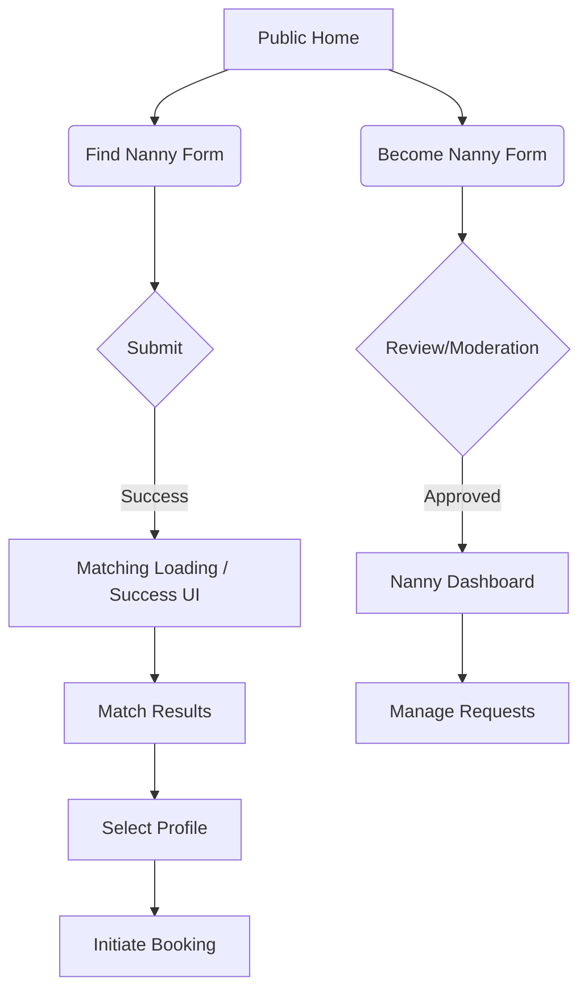

# PROJECT_DNA_V2

## 0. How to Use This Document
**Purpose:** This document functions as the external brain of the Blizko platform. It is the canonical handoff artifact designed for AI agents to allow 100% replication, context continuation, and architectural sanity.

**Usage Rules for AI Agents:**
- Read this file as the ultimate source of truth before performing any structural or UI code modifications.
- **Style > Speed, but Truth > Style.** Fidelity to the Trust-First Care-Tech constraints is mandatory. Speed of implementation never justifies breaking the product logic or aesthetics described here.
- **Mandatory Update:** If your code modifications change routes, schema, validation, matching weights, UI tokens, or UX copy, you MUST update the corresponding section in this document within the same session. Every material code change updates this file.

## 1. Product Identity
- **Definition:** Blizko is a trust-first nanny matching service.
- **What it is NOT:** A generic marketplace, a playful parenting app, or a cold enterprise software.
- **Target Audience:** Families seeking absolute peace of mind and strict vetting, and verified nannies looking for respected, safe employment.
- **Value Proposition:** Safe, predictable, AI-explained matching rather than infinite scrolling.
- **Emotional Tone:** Trust-first, premium editorial warmth, calm, reassuring, empathetic.
- **Care-Tech Constraints:** Zero anxiety. Data must be transparent but carefully revealed. 
- **Aesthetic Intent:** Premium but human. Rely on clean typography, soft spacings, and muted colors, not glitzy luxury.

## 2. Product Model
**Roles:**
- `parent`: Seeks a nanny, fills requests, browses AI-matched results.
- `nanny`: Provides care, goes through extreme vetting, manages schedule.
- `admin`: Oversees moderation, matching edges, platform safety.

**Entities & Core Objects:**
- User Profile (Parent/Nanny payloads).
- Booking (Deal lifecycle: Pending -> Confirmed -> Active -> Completed/Cancelled).
- Matching Request & Match Results (Geo, Budget, RiskEngine, Gemini Explanation).
- Chat Thread (Support vs. Match).

**Lifecycles:**
- *Nanny Lifecycle*: Onboarding -> Moderation -> Activation -> Ranking -> Matching -> Booking.
- *Booking Lifecycle*: Match Accept -> Intro Chat -> T-24h Confirmation -> Shift Execution.

## 3. Information Architecture
*Status: VERIFIED*
**Route Tree & Access Matrix:**
- `/` - Public - Home/Landing
- `/find-nanny` - Public - Parent Form (robots: noindex)
- `/become-nanny` - Public - Nanny Form
- `/success` - Public - Success state after form
- `/how-we-verify`, `/humanity-plus`, `/oferta`, `/about`, `/safe-deal`, `/privacy` - Public - SEO/Legal
- `/for-nannies` - Public - Nanny Landing Page
- `/nanny/:slug` - Public - Nanny Public Profile
- `/login` - Public - Authentication Portal
- `/match-results` - Protected (Session/State) - Renders matched results via hook `useMatchResults`.
- `/nanny-dashboard` - Protected (Requires Role: `nanny`) - Nanny management.
- `/family-dashboard` - Protected (Requires Role: `parent`) - Parent management.
- `/admin` - Protected (Requires Role: `admin`) - Admin moderation interface.

**Redirect Logic:** Unknown routes mismatchting catch-all `*` redirect to `/` (Home).

## 4. Frontend Architecture
*Status: VERIFIED*
**Stack:**
- **React:** 19.2.3
- **Build Tool:** Vite 6.2.0
- **Styling:** Tailwind CSS v4 (@tailwindcss/postcss)
- **Router:** React Router DOM v6
- **Animations:** Framer Motion
- **Database/Auth Client:** `@supabase/supabase-js` v2
- **Error Tracking:** Sentry React

**Folder Structure Protocol:**
```bash
mkdir -p src/{components/{app,seo,legal,dashboard,nanny},core/{i18n,platform,types},hooks,pages,services,utils}
```

**Architecture Notes:**
- Components are functional, hooks extract logic (`useAuthSession`, `usePwaInstall`, `useParentSubmit`, `useNannySubmit`, `useMatchResults`).
- Shared UI primitives follow Cloud Design constraints (no `1px` borders, soft gradients).

## 5. Database Architecture
*Status: VERIFIED from `migration_v1.sql` and `migration_v2_referrals.sql`*

**Tables & Schema:**
- `parents`: `id` (UUID, PK), `user_id` (UUID, FK), `payload` (JSONB), `created_at`, `updated_at`.
- `nannies`: `id` (UUID, PK), `user_id` (UUID, FK), `payload` (JSONB), `created_at`, `updated_at`.
- `bookings`: `id`, `parent_id`, `nanny_id`, `request_id`, `date`, `status` (Enum: pending, confirmed, active, completed, cancelled), `amount`.
- `booking_confirmations`: `id`, `booking_id`, `type` (default 't_24h'), `status`, `due_at`.
- `chat_threads`: `id`, `type` (support, match), `family_id`, `nanny_id`, `match_id`.
- `chat_messages`: `id`, `thread_id`, `sender_id`, `text`.
- `chat_participants`: `thread_id`, `user_id`, `role`.
- `admin_actions`: `id`, `admin_id`, `action`, `meta` JSONB.
- `referrals`: `id`, `referrer_id`, `code` (UNIQUE), `status` (pending, signed_up, completed), `reward_given`.

**Ownership & Lifecycles:**
- Data defaults to `JSONB` for `parents` and `nannies` for rapid schema iteration.
- Handled safely via RLS. Read by matching functions, updated by user and admin mutations.

**Triggers:**
- `update_updated_at` before UPDATE on `parents`, `nannies`.

## 6. Security Model
*Status: VERIFIED*

**Authentication:** Supabase Auth (Email/Phone/OAuth).
**Authorization:** Enforced via RLS at Postgres level. Admin access verified via `auth.jwt()->'user_metadata'->>'role' = 'admin'`.

**RLS Explicit SQL:**
```sql
CREATE POLICY "parents_owner" ON parents FOR ALL USING (auth.uid() = user_id);
CREATE POLICY "nannies_owner" ON nannies FOR ALL USING (auth.uid() = user_id);
CREATE POLICY "nannies_public_read" ON nannies FOR SELECT USING (true);
CREATE POLICY "bookings_participant" ON bookings FOR ALL USING (auth.uid() IN (parent_id, nanny_id));
CREATE POLICY "chat_threads_participant" ON chat_threads FOR ALL USING (auth.uid() IN (family_id, nanny_id));
CREATE POLICY "chat_messages_participant" ON chat_messages FOR ALL USING (
    thread_id IN (SELECT id FROM chat_threads WHERE auth.uid() IN (family_id, nanny_id))
);
CREATE POLICY "chat_participants_self" ON chat_participants FOR ALL USING (auth.uid() = user_id);
CREATE POLICY "confirmations_participant" ON booking_confirmations FOR ALL USING (
    booking_id IN (SELECT id FROM bookings WHERE auth.uid() IN (parent_id, nanny_id))
);
CREATE POLICY "admin_actions_admin" ON admin_actions FOR ALL USING ((auth.jwt()->'user_metadata'->>'role') = 'admin');
CREATE POLICY "referrals_owner" ON referrals FOR ALL USING (auth.uid() = referrer_id);
```

## 7. Matching System
*Status: VERIFIED (Client Side Hook), UNVERIFIED (Server Implementation)*

**Matching Inputs & Weights:**
- **GeoScore:** District exact (+20), Metro exact (+18), Line proximity (+14), Adjacent (+10-15), Fallback City (+5).
- **BudgetScore:** HARD FILTER if `expectedRate` > 2x budget. Exact ±10% (+15), Close ±20% (+12), Acceptable ±50% (+8).
- **Quality Score (QS):** Requires >=50 for visibility. >=85 yields premium boost.

**The Pipeline:**
- Matching removes unqualified candidates.
- Evaluates `RiskEngine` flags (Communication gaps, Discipline mismatches, infant experience).
- Gemini API (Prompt pipeline) yields `humanExplanation` describing EXACT fitness and warnings.
- Caps rendering to 3-5 candidates against the Paradox of Choice.

**`useMatchResults` Contract:**
- Data resolution priority:
  1. `?preview=1` (generates robust mock data with full AI explanations and Trust badges for Dev UI).
  2. `location.state.matchResult` (live data passed directly via React Router state).
  3. `localStorage.getItem('blizko_last_match_result')` (refresh resilience).
  4. Returns `null`.

## 8. Event Tracking & Funnel Logic
*Status: INFERRED*

**Event Mechanisms:** Basic analytics exist via `src/services/analytics.ts`.
- `trackAuthModalOpen(source: string)`: Fired on manual triggers.
- `trackLanguageSwitch(language: Language)`: Fired on locale toggle.
- Full funnel events (e.g., Parent Form Complete, Booking Requested) are structurally implied but their exact payloads remain opaque. Baseline assumption is simple GA/Amplitude tracking wrappers.

## 9. Screen Inventory
*Status: VERIFIED*

- **Home (`/`)**: Entry. Public. CTA: Find Nanny / Become Nanny.
- **Find Nanny (`/find-nanny`)**: Parent requirement form. High trust signal. Success routes to `/success`.
- **Match Results (`/match-results`)**: Core value delivery. Shows 3 evaluated profiles via `useMatchResults`. Primary CTA: Contact / Book.
- **Nanny Profile (`/nanny/:slug`)**: Public resume. Shows trust badges, AI checkmarks, verified reviews.
- **Auth Modal**: Global accessible. Allows login to retrieve existing matches / dashboards. Emits `trackAuthModalOpen`.
- **Dashboards (`/nanny-dashboard`, `/family-dashboard`)**: Role-gated. Show active bookings and state workflows.

## 10. Full Copy Inventory
*Status: VERIFIED*

| Screen | Element | Exact Text (RU/EN) | Placement Reason | UX Goal | State | STATUS |
| --- | --- | --- | --- | --- | --- | --- |
| Match Results | Overall Advice | "Мы оставили только те профили, где можно..." | Header | Alleviate analysis paralysis | Success | VERIFIED |
| Nanny Form | Submit | "Стать няней в Blizko" / "Become a nanny..." | Main CTA | Clear intent, no generic "Submit" | Default | VERIFIED |
| Dashboard | Empty State | "Пока нет заказов. Нажмите «Найти няню» — подберём за час." | List view | Lower activation energy | Empty | VERIFIED |
| Error / Load | 500 Network | "Нет связи. Как только интернет вернётся..." | Global Boundary | De-escalation of panic | Error | VERIFIED |
| Candidate Card | AI Warning | "Уточните вечерний график заранее." | Inside candidate card | Honest expectation setting | Warning | VERIFIED |
| Nanny Profile | Trust Badge | "✓ Документы проверены" | Hero | Validate safety instantly | Static | VERIFIED |

## 11. Design System
*Status: VERIFIED*

**Tokens (Cloud Design System):**
- **Colors:** `--surface`: `#fcf9f4`, `--primary`: `#735c00`, `--tertiary`: `#006e1c`. Soft ambient colors > harsh contrast.
- **Typography:** `Newsreader` (Hero, headers, `-0.02em` spacing), `Manrope` (UI, buttons, metadata).
- **Spacing/Grid:** 8pt grid base (`gap-4` = 16px, `gap-8` = 32px).
- **Rounding:** Radii are soft (`cloud-radius-card`: 24px, buttons: 9999px pill).
- **Borders:** Strictly prohibited 1px solid dividers (No-Line Rule). Use ghost borders (`var(--cloud-border)` at 11% opacity).
- **Shadows:** Dense Ambient Shadows (`0 16px 40px rgba(96, 77, 58, 0.08)`) instead of sharp drop shadows.

## 12. Design Override Layer
*Status: VERIFIED*

**Redesign Transition Rules:**
- **Visual Changes:** App is migrating from generic "marketplace" look to "Cloud System". Soft beige/cream (`#f7f2e8`), green trust indicators.
- **Risk Assessment:** Reverting soft shadows to sharp borders poses a High Trust Risk. Changing `Newsreader` to a system sans-serif font poses a High Visual Risk (loses editorial premium feel).
- **Preserved Signals:** Verified document ticks, review metrics, semantic routing boundaries. Complete mapping is available in `DESIGN_OVERRIDE_MAP.md`.

## 13. Motion & Microinteractions
*Status: VERIFIED*

- **Duration/Easing:** `300ms ease-out` (`cubic-bezier(0.16, 1, 0.3, 1)`).
- **Motion Philosophy:** Slow and weighted. Never use bounce or spring. Interactions effectuating a "turning a heavy, high-quality magazine page" rhythm.
- **Hover States:** Lift transformation (`translateY(-2px)`) + shadow expansion (`cloud-shadow-hover`) instead of color flash.
- **Skeletons:** Low opacity, slow pulse. Absolute restriction of fast spinner loops.

## 14. Edge Cases & Failure States
*Status: VERIFIED*

- **Offline / Disconnect:** Handled gracefully. Copy: "Нет связи. Как только интернет вернётся..." Recovery: Auto-fetch on reconnect.
- **No Results (Matching):** Does not abandon user. Suggests adjusting parameters, shows manual support CTA instead of deep void.
- **Corrupted Cache:** `useMatchResults` hook specifically wraps `#blizko_last_match_result` in `try/catch`. If invalid, falls back gracefully to `null` and empties state without crashing app.

## 15. User Flows
*Status: VERIFIED*


Critical Branch Points: Registration triggers Auth Modal. Matching triggers Geo + Budget Filters.

## 16. File-to-Documentation Responsibility Map
*Status: REQUIRED/VERIFIED*

| File / Folder | Change Type | Must Update DNA Section | Extra Required File |
| --- | --- | --- | --- |
| `supabase/migrations/*.sql` | Schema | 5. Database Architecture, 6. Security Model | `CHANGELOG_PROJECT_DNA.md` |
| `src/hooks/useMatchResults.ts` | Logic / AI Flags | 7. Matching System | `OPEN_QUESTIONS.md` (if API changes) |
| `src/App.tsx` | Routing / Auth | 3. Information Architecture, 9. Screen Inventory | - |
| `index.css` | Design Tokens | 11. Design System | `DESIGN_OVERRIDE_MAP.md` |
| `src/components/` | UX Copy | 10. Full Copy Inventory | - |

## 17. Changelog & Update Protocol
*Status: VERIFIED*

When any material change is executed:
1. Classify the impact (Visual vs Logic vs Database).
2. Update the corresponding sections in this `PROJECT_DNA_V2.md` file.
3. Append a detailed entry to `CHANGELOG_PROJECT_DNA.md`.
4. Update `OPEN_QUESTIONS.md` if the change produces ambiguities.
5. All commits updating this logic must include the `[DNA-UPDATE]` tag in their commit message.
6. The DNA file must NEVER be left stale.

## 18. Known Drift Risks
*Status: INFERRED*

- **Copy Drift:** Forms and error banners hardcoded directly inside React components may bypass the UX copy inventory if not tracked properly.
- **RLS vs Server Sync:** If matching backend edge functions query Supabase using the `service_role` key, the strict RLS may technically be bypassed for that isolated function, hiding bugs.
- **Design Token Drift:** Developers using arbitrary `w-auto px-12 text-[#333]` inline tailwind instead of semantic cloud-tokens.

## 19. Open Questions
*Status: INFERRED*
All ambiguities are actively tracked in the external `OPEN_QUESTIONS.md` document, including unresolved API payload tracking, backend matching execution pipelines, and exact offline PWA behavior states.

## 20. Verification Status

| Section | Last Verified | Basis | Certainty | Unresolved Gaps |
| --- | --- | --- | --- | --- |
| 3. Architecture | 2026-04-02 | `src/App.tsx` | High | Edge route guards |
| 5. Database | 2026-04-02 | `supabase/*.sql` | High | None |
| 7. Matching Hook | 2026-04-02 | `useMatchResults.ts` | Medium | Backend API resolving |
| 8. Analytics | 2026-04-02 | `src/App.tsx` | Low | Exact tracking payload |
| 11. Design Tokens | 2026-04-02 | `index.css` | High | Component outliers |
