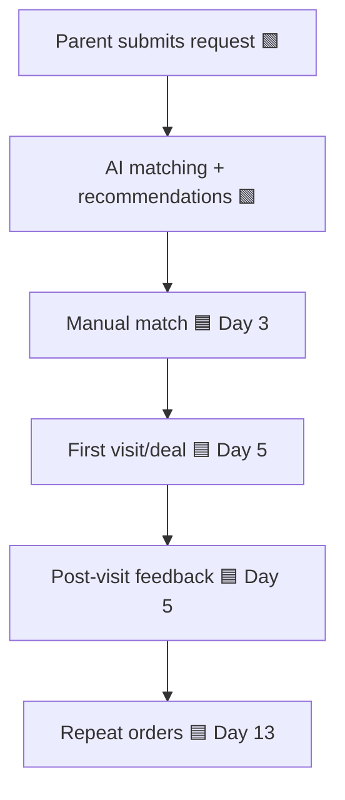
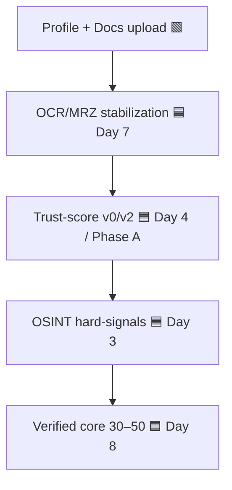

# Blizko — Roadmap & Architecture (diagram)

> Legend: 🟩 exists • 🟦 planned

## 1) System Architecture (Now vs Planned)
```mermaid
flowchart TB
  subgraph Client[Client — Vite/React 🟩]
    PF[ParentForm 🟩]
    NF[NannyForm 🟩]
    AM[AuthModal/UserProfile 🟩]
    ADM[AdminPanel 🟩]
    DU[DocumentUploadModal 🟩]
  end

  subgraph API[Vercel API 🟩]
    OTP1[/api/auth/send-otp-phone 🟩]
    OTP2[/api/auth/verify-otp-phone 🟩]
    AI[/api/ai (matching/document) 🟩]
    NOTIF[/api/notify 🟩]
    DATA[/api/data/parents|nannies 🟩]
  end

  subgraph DB[Supabase 🟩]
    T1[(parents 🟩)]
    T2[(nannies 🟩)]
    RLS[[RLS checks 🟦]]
  end

  subgraph Ext[External Services]
    SMS[SMSAero 🟩]
    SENTRY[Sentry 🟩]
    RESEND[Resend 🟩]
    OSINT[OSINT checks 🟦]
    TRUST[Trust-score 2.0 🟦]
  end

  Client --> API --> DB
  API --> Ext
```

## 2) Deal Flow (Weeks 1–2)


## 3) Quality Base (Nannies)


## 4) 8‑Week Execution Timeline
```mermaid
flowchart LR
  W1[Weeks 1–2\nDeals launch (Days 1–14) 🟦] --> W2[Weeks 3–4\nPayments + scale (Days 15–28) 🟦]
  W2 --> W3[Weeks 5–6\nApp Store readiness (Days 29–42) 🟦]
  W3 --> W4[Weeks 7–8\nRelease (Days 43–56) 🟦]
```

## 5) AI Roadmap (Phases A–C)
```mermaid
flowchart LR
  A[Phase A (1–2 mo)\nNLP analysis, scoring, explainability 🟦] -->
  B[Phase B (2–3 mo)\nVideo interview, CV signals, Risk‑engine 2.0 🟦] -->
  C[Phase C (3–4 mo)\nML ranking, personalized scenarios, predictive reserve 🟦]
```

## 6) Product Blocks
```mermaid
flowchart TB
  KB[Quality Base 🟦]
  CM[Compatibility (Mirror+/PCM) 🟦]
  ST[Stability/Guarantee of arrival 🟦]
  PAY[Payments & economics 🟦]
  OPS[Operational launch 🟦]
  MOB[Mobile packaging 🟦]

  KB --> CM --> ST --> PAY --> OPS --> MOB
```

## 7) Services to Connect (Now vs Planned)
```mermaid
flowchart TB
  subgraph Core[Core 🟩]
    SB[Supabase (DB/Auth/Storage) 🟩]
    VERCEL[Vercel API/Hosting 🟩]
  end

  subgraph Ops[Ops/Comms]
    SMS[SMSAero (OTP) 🟩]
    RESEND[Resend (email) 🟩]
    TG[Telegram bot (ops) 🟩]
    PUSH[Push notifications 🟦]
  end

  subgraph Analytics[Observability]
    SENTRY[Sentry 🟩]
    ANALYTICS[Product analytics 🟦]
  end

  subgraph Payments[Payments]
    YK[ЮKassa (create payment + webhook + payments table) 🟦]
  end

  subgraph AI[AI/Verification]
    AIAPI[AI provider (matching/document) 🟩]
    OCR[OCR/MRZ + face‑match 🟦]
    OSINT[OSINT checks 🟦]
  end

  Core --> Ops
  Core --> Analytics
  Core --> Payments
  Core --> AI
```

## 8) Roles & Master Roles (Owners)
```mermaid
flowchart TB
  subgraph Product[Product]
    PL[Product Lead (master) 🟩]
    UX[UX/Design 🟦]
  end

  subgraph Ops[Operations]
    OPSL[Ops Lead (master) 🟩]
    MOD[Moderators 🟦]
    QA[Quality Control 🟦]
  end

  subgraph Tech[Tech]
    ENG[Engineering Lead (master) 🟩]
    DATA[Data/ML 🟦]
  end

  subgraph Legal[Legal/Compliance]
    LEG[Legal owner (master) 🟦]
    DPO[DPO / privacy 🟦]
  end

  PL --> OPSL
  PL --> ENG
  PL --> LEG
```
