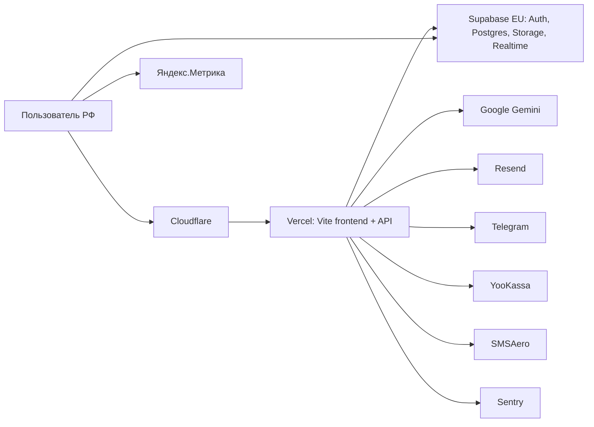
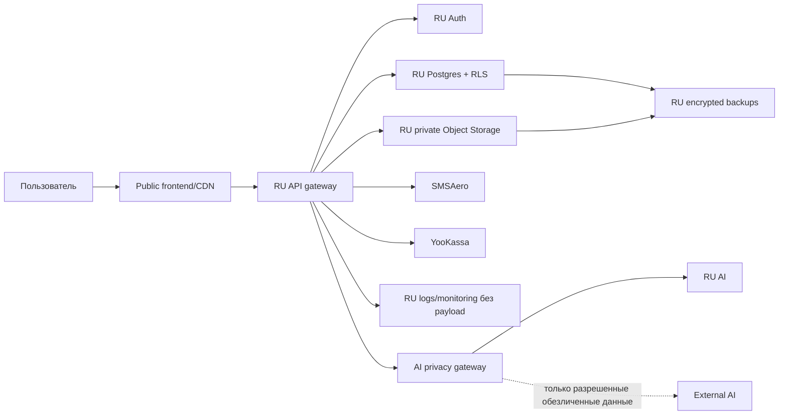
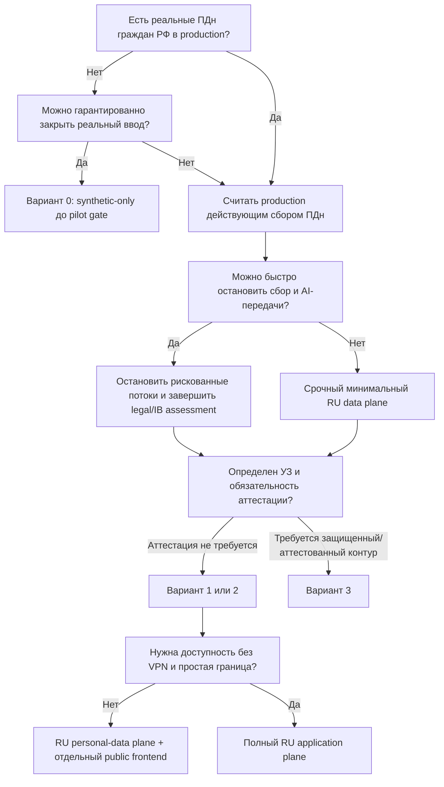

# Blizko: решение о российском контуре персональных данных

Статус: рабочий decision memo
Дата проверки: 13 июня 2026 года
Назначение: определить, нужен ли Blizko отдельный российский контур, когда он нужен и какой объем контура достаточен.

> Документ описывает текущее техническое состояние и вопросы для принятия решения. Он не заменяет юридическое заключение по 152-ФЗ, определение уровня защищенности ИСПДн и модель угроз.

## 1. Решение, которое необходимо принять

Нужно ответить не на вопрос «как перенести Supabase», а на четыре последовательных вопроса:

1. Обрабатывает ли Blizko сейчас реальные персональные данные граждан РФ?
2. Какие операции и внешние сервисы участвуют в этой обработке?
3. Какой минимальный контур устраняет выявленные юридические и эксплуатационные риски?
4. На каком этапе продукта этот контур должен быть введен?

Self-hosted Supabase, Yandex Cloud и Timeweb являются вариантами реализации. Они не должны становиться решением до ответов на эти вопросы.

## 2. Краткий вывод по текущему состоянию

Blizko уже технически способен обрабатывать реальные персональные данные:

- production-приложение доступно на `blizko.app`;
- оператором в политике указан ИП Аносов Антон Владимирович;
- есть регистрация по телефону и email;
- собираются анкеты родителей и нянь;
- обрабатываются сведения о ребенке, графике, районе и бюджете;
- предусмотрены паспорт, медкнижка, рекомендации и другие документы;
- есть чат поддержки, платежи, аналитика и AI-обработка;
- данные и документы хранятся в Supabase EU;
- API работает в Vercel;
- часть пользовательского контекста и изображения документов может передаваться в Google Gemini.

Следовательно:

- если в production уже есть реальные данные граждан РФ, вопрос локализации нельзя откладывать до масштабирования;
- если production содержит только синтетические данные и доступ к реальному вводу закрыт, полный переезд можно отложить до открытия пилота;
- необходимость именно self-hosted Supabase или УЗ-1 пока не доказана.

## 3. Что означает «разнести контур»

Разнести контур означает отделить обработку персональных данных от публичной доставки приложения и от необязательных внешних сервисов.

### 3.1. Public plane

Компоненты, которые могут не получать персональные данные:

- лендинг и публичные страницы;
- статические JS/CSS/изображения;
- публичный каталог с заранее очищенными полями;
- документация и SEO-контент.

Public plane теоретически может оставаться на глобальном CDN, если запросы, логи, cookies и формы не передают туда ПДн. Для Blizko также нужно учитывать фактическую доступность из РФ.

### 3.2. Personal-data plane

Компоненты, которые получают, изменяют, хранят или извлекают ПДн:

- формы родителей и нянь;
- Auth и телефонный OTP;
- профили и заявки;
- чат и поддержка;
- документы, фотографии и видео;
- админская модерация;
- matching и история взаимодействий;
- платежные операции и связанные метаданные;
- резервные копии;
- аудит и технические логи, если в них попадают идентификаторы.

Если необходим российский контур, этот plane должен работать на российских базах данных и хранилищах. Серверные функции, обрабатывающие payload, также входят в границу контура.

### 3.3. External processors

Каждый внешний сервис нужно классифицировать отдельно:

- получает ли он ПДн;
- какие именно поля получает;
- где происходит обработка и хранение;
- сохраняет ли он запросы;
- можно ли отключить retention;
- есть ли договорное поручение на обработку;
- является ли передача трансграничной;
- можно ли заменить данные токеном или обезличенным представлением.

### 3.4. Jurisdiction Router

Маршрутизация должна выбирать единый `JurisdictionPolicy`, а не только
AI-агента. Политика определяет:

- применимую legal policy;
- data plane;
- разрешенных AI-провайдеров;
- версию согласия;
- retention и deletion;
- набор процессоров;
- logging и analytics.

Юрисдикция вычисляется только server-side из проверенных сигналов: страны
OTP-подтвержденного телефона, зафиксированных сервером сведений о
резидентстве/гражданстве и конфигурации страны сервиса. IP, язык, timezone и
геолокация являются advisory-only: они не понижают политику и используются
только в минимизированном аудите.

Router должен отдельно учитывать страну сервиса, место первого сбора,
гражданство/резидентство субъекта и применимое право. Клиент не может задавать
или переопределять итоговую юрисдикцию. Результат пинится к аккаунту и сессии,
подписывается сервером, версионируется и аудируется. При конфликте или
недостаточности подтвержденных сигналов применяется строжайшая политика.

MVP-матрица:

| Jurisdiction | Data plane | Collection | External AI on personal data | Sensitive flows |
|---|---|---|---|---|
| `RU` | `ru-core` | full only after current consent | blocked until cross-border gate | blocked until separately approved |
| `UNKNOWN` | `none` | minimal | blocked | blocked |
| `EU` | `none` | none | blocked | blocked |

`UNKNOWN` является fail-closed режимом RU-grade: пока применимость требований
для граждан РФ не исключена проверенными данными, нельзя выбирать более слабый
контур, выполнять запись ПДн или передавать их внешнему AI. Это консервативное
правило маршрутизации, а не автоматический юридический вывод о статусе
конкретного пользователя.

EU в MVP является только интерфейсной заглушкой: европейский data plane пока
не строится. Cross-region dual-write запрещен по умолчанию. Смена страны
требует повторной оценки, owner/admin approval и контролируемой миграции без
автоматического копирования; до завершения действует прежняя, более строгая
политика.

## 4. Текущая техническая схема



Важная особенность: browser напрямую обращается к Supabase. Перенос только серверных API не локализует клиентские чтения, записи, Auth и Storage.

### 4.1. Подтвержденные хранилища и потоки

| Компонент | Текущее состояние | Возможные данные | Риск/вопрос |
|---|---|---|---|
| Supabase Auth | EU-проект | телефон, email, user ID, metadata | основная точка идентификации |
| Supabase Postgres | EU-проект | анкеты, заявки, чат, matching, платежные метаданные | основное хранение и извлечение ПДн |
| Supabase Storage | EU-проект | паспорт, медкнижка, фото, видео, резюме | документы и потенциально специальные категории |
| Vercel Functions | глобальная инфраструктура | API payload, JWT, профиль, чат, платежные данные | обработка ПДн вне БД |
| Gemini | Google API | prompts, история поддержки, профиль, изображения документов | трансграничная AI-обработка |
| Resend | email API | email, содержание уведомления | проверить регион и договор |
| Telegram | Bot API | сообщения и возможный пользовательский контекст | проверить состав передаваемых данных |
| SMSAero | SMS API | телефон, OTP/сервисный текст | российский процессор, требуется договорная проверка |
| YooKassa | платежи | email, телефон, параметры заказа | отдельный регулируемый процессор |
| Яндекс.Метрика | browser analytics | IP, cookies, события | проверить настройки и состав событий |
| Sentry | monitoring | ошибки, URL, user/context, payload fragments | исключить ПДн и проверить регион ingest |
| Cloudflare | proxy/CDN | IP, headers, cookies, URL | определить границу публичного plane |

### 4.2. Категории данных, найденные в коде

Родители:

- город, район и метро;
- возраст ребенка;
- график;
- бюджет;
- требования и комментарий;
- email и телефон;
- история изменений и risk profile;
- документы, если они прикрепляются.

Няни:

- имя и контакт;
- фото и видео;
- город, район, опыт и график;
- анкета soft skills и risk profile;
- паспорт;
- медкнижка;
- документы об образовании;
- рекомендации;
- резюме, включая телефон и email;
- результаты AI-анализа документов.

Коммуникации:

- сообщения поддержки;
- сообщения match-чата;
- история тикета;
- контекст семьи;
- действия администратора.

## 5. Факты, которые требуют отдельного внимания

### 5.1. Документы отправляются в Gemini

`analyzeDocument()` преобразует изображение документа в base64 и отправляет его через `/api/ai` в Gemini. Это может включать паспорт, медкнижку, резюме и иные документы.

Это наиболее чувствительный текущий поток. До отдельного решения его следует рассматривать как потенциальную передачу полного изображения документа иностранному AI-провайдеру.

### 5.2. AI-support получает персонализированный контекст

`/api/ai-support` формирует prompt с историей диалога и полями семьи, включая город, возраст ребенка, график и бюджет.

Отключение только AI-анализа документов не устраняет все AI-передачи.

### 5.3. Политика прямо указывает Supabase EU

Текущая `/privacy` сообщает пользователю, что данные хранятся на серверах Supabase в ЕС. Это подтверждает осознанную текущую архитектуру, но само раскрытие не отменяет требования применимого законодательства.

### 5.4. Согласия существуют, но этого недостаточно для архитектурного вывода

В parent и nanny flow есть отдельные checkbox для оферты и обработки ПДн. Необходимо проверить:

- точный текст согласия;
- версию документа;
- доказательство акцепта: кто, когда и какую редакцию принял;
- отдельные основания для специальных категорий;
- перечень третьих лиц и трансграничных передач;
- возможность и последствия отзыва.

Наличие checkbox само по себе не подтверждает соответствие всей обработки.

## 6. Варианты решения

### Вариант 0. Закрытый технический стенд

Подходит, если реальных пользователей и реальных ПДн нет.

Условия:

- публичный ввод реальных данных закрыт;
- используются только синтетические профили и документы;
- test accounts не принадлежат реальным людям;
- Gemini не получает реальные документы;
- до открытия пилота установлен обязательный data-contour gate.

Что дает:

- позволяет не делать инфраструктурную миграцию немедленно;
- сохраняет возможность завершить PoC;
- не подходит для работающего пилота с гражданами РФ.

### Вариант 1. Минимальный RU personal-data plane

Подходит для пилота после подтверждения базовых требований.

Состав:

- Auth, Postgres и Storage в РФ;
- API, которые получают ПДн, исполняются в РФ;
- backup и recovery copies находятся в РФ;
- OTP через российский сервис;
- AI получает только разрешенные обезличенные данные либо отключен;
- frontend может быть отделен и размещен независимо;
- логи и monitoring очищены от ПДн.

Что дает:

- минимально необходимую локализацию data plane;
- меньшую стоимость, чем полный защищенный enterprise-контур;
- возможность сохранить публичную статику отдельно.

Что не доказывает:

- соответствие выбранному УЗ;
- достаточность мер защиты;
- корректность уведомлений и согласий;
- допустимость каждой внешней передачи.

### Вариант 2. Полный RU application plane

Подходит, если важна доступность без VPN или сложно гарантировать отсутствие ПДн в глобальном frontend/API.

Состав:

- frontend/CDN в РФ;
- API/compute в РФ;
- Auth/Postgres/Storage/Realtime в РФ;
- российские backup, monitoring, email/SMS;
- российский AI либо строгий de-identification gateway;
- WAF, secrets, audit, incident response и restore process.

Что дает:

- понятную сетевую и юридическую границу;
- меньше зависимостей от Vercel/Supabase EU;
- более надежную доступность для пользователей РФ.

Цена:

- больше эксплуатационной ответственности;
- дольше миграция;
- нужен DevOps/runbook и регулярная проверка восстановления.

### Вариант 3. Защищенный или аттестованный контур

Выбирается не по маркетинговому названию провайдера, а после определения:

- состава ИСПДн;
- категорий и объема данных;
- актуальных угроз;
- требуемого уровня защищенности;
- обязательности аттестации или иной формы оценки;
- границы ответственности оператора и провайдера.

Состав зависит от заключения специалиста. Возможные элементы:

- сегментированная сеть;
- сертифицированные средства защиты;
- формализованная модель угроз;
- управление доступом и журналирование;
- процедуры реагирования;
- оценка эффективности мер;
- аттестация, если она требуется выбранной модели.

## 7. Рекомендуемая целевая схема при подтвержденной необходимости



Принцип: внешний сервис не должен получать исходный профиль или документ только потому, что это технически удобно.

## 8. Как технически разнести текущий контур

### Этап A. Инвентаризация и остановка неконтролируемых потоков

1. Зафиксировать все точки сбора и все таблицы/buckets.
2. Составить data-flow matrix: поле → цель → основание → хранилище → получатель → срок.
3. Проверить production на наличие реальных данных.
4. Отключить передачу паспортов и медкнижек в Gemini до отдельного решения.
5. Отключить персонализированный AI-support или удалить из prompt ПДн.
6. Проверить Sentry, Метрику, Telegram и email на попадание payload.
7. Зафиксировать версии согласий и evidence их принятия.

Результат этапа: понятно, есть ли уже действующий production-риск и что нужно прекратить немедленно.

### Этап B. Архитектурная граница

1. Создать domain repositories:
   - `AuthRepository`;
   - `ParentRepository`;
   - `NannyRepository`;
   - `ChatRepository`;
   - `MatchingRepository`;
   - `FileRepository`.
2. Убрать прямые `supabase.from()` и Storage-вызовы из UI/domain logic.
3. Разделить public API и personal-data API.
4. Добавить data classification к endpoint и event schemas.
5. Ввести запрет на отправку полей класса `restricted` во внешние AI/observability.

Результат этапа: инфраструктуру можно менять без переписывания продуктовой логики.

### Этап C. PoC российского data plane

Обязательные тесты:

- T1: SMSAero → регистрация → сессия → refresh;
- T2: GoTrue JWT → PostgREST → `auth.uid()` → RLS;
- T3: private Storage → upload → signed URL → expiry;
- T4: Yandex Object Storage или другой S3 backend;
- T5: Realtime для chat/support;
- T6: backup → удаление тестовой БД → restore → сверка;
- T7: rotation JWT/secrets без потери доступа;
- T8: latency и доступность с российских мобильных операторов;
- T9: миграция тестового пользователя и стратегия повторного входа;
- T10: удаление аккаунта во всех связанных таблицах и объектах.

Результат этапа: подтверждено, что выбранный стек работает, а не только заявлен в документации.

### Этап D. Миграция

Предпочтительно делать однонаправленное переключение:

1. заморозить создание новых данных на короткое окно;
2. экспортировать Auth, Postgres и Storage;
3. импортировать данные в RU-контур;
4. провести сверку количества и контрольных сумм;
5. переключить env и DNS/API routes;
6. принудительно переавторизовать пользователей, если перенос сессий небезопасен;
7. провести smoke RLS/Auth/Storage/Chat/Payment;
8. оставить старый контур read-only только на утвержденный период;
9. удалить данные из EU после юридически и операционно подтвержденного завершения.

Dual-write не рекомендуется как базовый путь: он увеличивает период, когда данные существуют в двух юрисдикциях, усложняет удаление и создает риск расхождения.

### Этап E. Эксплуатация

До production должны существовать:

- owner каждого сервиса;
- мониторинг доступности;
- журнал привилегированных действий;
- backup schedule;
- проверенный restore;
- secret rotation;
- incident response;
- сроки удаления;
- реестр процессоров;
- регулярная проверка external AI и analytics payload.

## 9. Вопросы, определяющие необходимость контура

### 9.1. Вопросы владельцу продукта

1. Открыта ли регистрация для реальных пользователей?
2. Есть ли сейчас в production реальные телефоны, email или анкеты?
3. Загружались ли реальные паспорта, медкнижки, резюме, фото или видео?
4. Были ли реальные платежи?
5. Есть ли пользователи, являющиеся гражданами РФ?
6. Где пользователь физически находится при сборе данных?
7. Можно ли закрыть ввод реальных данных до принятия решения?
8. Когда запланирован первый открытый пилот?
9. Сколько пользователей и документов ожидается на пилоте и через 12 месяцев?
10. Нужна ли работа приложения без VPN как обязательный SLA пилота?

Критический ответ: если реальные данные граждан РФ уже собираются, Вариант 0 перестает быть приемлемым.

### 9.2. Вопросы юристу по 152-ФЗ

1. Является ли ИП указанным оператором всех перечисленных процессов?
2. Какие операции Blizko являются сбором ПДн граждан РФ?
3. Какие категории данных обрабатываются по каждой пользовательской роли?
4. Какие поля относятся к специальным категориям?
5. Использует ли Blizko фото/видео для установления личности и возникает ли биометрия?
6. Какое основание обработки применяется к каждой цели?
7. Нужны ли отдельные письменные согласия для документов и сведений о здоровье?
8. Достаточно ли текущих согласий и как хранить доказательство их версии/акцепта?
9. Требуется ли уведомление Роскомнадзора и соответствует ли ему фактическая схема?
10. Какие текущие передачи являются трансграничными?
11. Допустима ли последующая передача в Gemini после локализации первичной базы?
12. Какое обезличивание считается достаточным для AI use cases Blizko?
13. Какие поручения обработки нужны с SMSAero, YooKassa, email, analytics, hosting и support-провайдерами?
14. Какой уровень защищенности ИСПДн требуется?
15. Обязательна ли аттестация для выбранной системы или достаточно оценки эффективности мер?
16. Какие сроки хранения и удаления нужны для профилей, чатов, документов, логов и backup?
17. Что необходимо сделать с уже собранными данными в EU?
18. Можно ли оставить публичный frontend на зарубежном CDN при RU API/data plane?

### 9.3. Вопросы специалисту по ИБ

1. Где проходит точная граница ИСПДн?
2. Какие актуальные угрозы применимы к Blizko?
3. Какой УЗ следует из состава данных и масштаба?
4. Какие средства защиты обязательны, а какие рекомендуемы?
5. Нужно ли выделять документы в отдельный storage/security domain?
6. Можно ли хранить document metadata и файлы в разных системах?
7. Какие логи допустимы и как их деперсонализировать?
8. Как организовать доступ кураторов и администраторов?
9. Нужны ли VPN, bastion, MFA, PAM или device restrictions?
10. Как подтверждать удаление данных из backups?
11. Как часто проводить restore drill и access review?
12. Какие доказательства соответствия необходимо сохранять?

### 9.4. Вопросы российскому cloud-провайдеру

1. В каких ЦОД физически размещаются VM, DB, Object Storage и backup?
2. Какие сервисы входят в заявленный 152-ФЗ/УЗ-контур?
3. Какие сервисы не входят в аттестованную границу?
4. Можно ли получить номер, область действия и срок аттестата?
5. Кто отвечает за ОС, контейнеры, PostgreSQL, ключи, RLS и приложение?
6. Есть ли managed PostgreSQL или потребуется self-hosting?
7. Есть ли S3-compatible storage и поддерживаются ли signed URLs?
8. Где хранятся snapshots и cross-region replicas?
9. Как устроены KMS, secret storage, WAF, DDoS и audit logs?
10. Есть ли SLA, RPO и RTO?
11. Как выполняется уничтожение данных и выдаются ли подтверждения?
12. Можно ли заключить поручение на обработку ПДн?
13. Какова полная цена пилота и production, включая трафик, backup и защиту?
14. Что меняется в цене и архитектуре при переходе на УЗ-1?

### 9.5. Вопросы Supabase/self-hosting PoC

1. Совместима ли выбранная версия GoTrue с текущим `supabase-js`?
2. Сохраняется ли семантика JWT claims и `auth.uid()`?
3. Как переносить пользователей и password/phone identities?
4. Можно ли безопасно перенести refresh tokens или нужна повторная авторизация?
5. Работают ли Send SMS Hook и SMSAero в выбранной версии?
6. Работает ли Storage с выбранным S3 endpoint?
7. Как генерируются signed URLs?
8. Работают ли Realtime и публикации для chat tables?
9. Как обновлять Supabase без простоя?
10. Кто отвечает за security patches и observability?
11. Как выполняются backup и point-in-time recovery?
12. Как проверяется совместимость миграций с hosted Supabase?

## 10. Дерево решения



## 11. Этапные гейты

### Gate 0. До следующего реального пользователя

Нужно знать:

- есть ли реальные данные сейчас;
- закрыт ли ввод;
- отправляются ли реальные документы/профили в Gemini;
- кто является оператором;
- подано ли корректное уведомление Роскомнадзора.

Нельзя открывать пилот, если эти ответы неизвестны.

### Gate 1. До пилота

Обязательно:

- утвержденная data map;
- юридическая позиция по локализации и внешним передачам;
- выбранный минимальный RU data plane;
- успешные T1-T10;
- согласия и политика соответствуют фактическим процессорам;
- backup/restore проверен;
- Gemini policy определена.

### Gate 2. До приема документов и медкнижек

Дополнительно:

- классификация специальных категорий;
- отдельное основание обработки;
- private storage;
- ограничение доступа кураторов;
- запрет полного документа во внешнем AI без отдельного разрешения;
- журнал просмотра и удаления.

### Gate 3. До масштабирования и платного запуска

Дополнительно:

- заключение по УЗ и модели угроз;
- договоры с процессорами;
- incident response;
- access reviews;
- SLA/RPO/RTO;
- нагрузочный тест;
- проверка доступности из РФ;
- оценка необходимости полного RU application plane.

## 12. Как интерпретировать ответы

| Ситуация | Решение |
|---|---|
| Реальных данных нет, ввод закрыт | Не мигрировать немедленно; завершить PoC до пилота |
| Реальные данные есть, но сбор можно остановить | Остановить сбор/AI, получить заключение, затем мигрировать |
| Реальные данные есть и сервис продолжает работать | Минимальный RU data plane нужен как срочный проект |
| Юрист/ИБ не требуют аттестацию | Выбрать обычный RU cloud с подтвержденными мерами защиты |
| Определен высокий УЗ или обязательна аттестация | Выбирать отдельный защищенный продукт провайдера |
| Проблема только в доступности статики | Nginx/CDN решает доступность, но не локализацию данных |
| ПДн остаются в Vercel API | Перенос одной БД недостаточен |
| Gemini получает исходные документы | AI-поток остановить или заменить независимо от миграции БД |
| EU expansion не запущен | Не строить dual-region до стабилизации RU-контура |

## 13. Предварительная техническая рекомендация

До получения ответов не покупать УЗ-1 и не начинать полный multi-region.

Последовательность:

1. За один рабочий цикл подтвердить наличие реальных production-данных.
2. Немедленно исключить реальные документы и персонализированный контекст из Gemini.
3. Получить письменные ответы юриста и специалиста по ИБ.
4. Параллельно выполнить дешевый PoC self-hosted Supabase в РФ на синтетике.
5. После определения УЗ выбрать:
   - обычный RU cloud;
   - защищенный cloud-продукт;
   - альтернативный российский backend вместо Supabase.
6. До открытого пилота перенести весь personal-data plane, если применимость локализации подтверждается.
7. EU/GDPR-контур проектировать только после стабильного RU production.

## 14. Критерий завершения решения

Решение о контуре считается принятым, когда существует один подписанный decision record со следующими полями:

```text
Есть реальные ПДн в production: да / нет
Сбор до миграции: открыт / закрыт
Оператор:
Категории данных:
Специальные категории:
Биометрия:
Требуемый УЗ:
Аттестация обязательна: да / нет / не определено
Разрешенные внешние процессоры:
Разрешенный AI-поток:
Выбранный вариант: 0 / 1 / 2 / 3
Провайдер:
Pilot gate date:
Owner:
```

Если хотя бы поля «реальные ПДн», «требуемый УЗ», «AI-поток» или «выбранный вариант» остаются неопределенными, решение еще не принято.

## 15. Файлы и источники для проверки

Репозиторий:

- `src/services/supabase.ts` — browser Supabase client;
- `src/services/storage.ts` — профили родителей и нянь;
- `src/services/storageUpload.ts` — документы и фотографии;
- `src/core/ai/documentAi.ts` — AI-анализ изображений документов;
- `src/core/ai/aiGateway.ts` — отправка текста и изображений в `/api/ai`;
- `api/ai.ts` — вызов Gemini;
- `api/ai-support.ts` — история чата и контекст семьи;
- `api/auth/phone.ts` — OTP и SMSAero;
- `src/components/legal/LegalPages.tsx` — оператор, политика и текущее указание Supabase EU;
- `docs/adr/001-rf-availability.md` — отдельная проблема доступности из РФ;
- `infra/nginx-rf-proxy.conf` — решение доступности, не локализации.

## Timeweb vs Yandex Cloud — обновлённое сравнение (2026-06-30)

Контекст: Yandex Cloud выдал грант 10 000 ₽ / 2 мес (account-447). Phase 3 PoC
развёрнут в сторону Yandex (RISK-006, `ru-core-yandex-cloud-poc.md`, BLI-135).
Ниже — фактическая сверка возможностей для prod-решения после PoC. Поправка к
прежнему тезису «Timeweb = только цена»: **Timeweb тоже имеет УЗ-1**.

| Возможность | Timeweb Cloud | Yandex Cloud |
|---|---|---|
| Managed PostgreSQL | **14–18** (вкл. 17/18 → совместим с прод 17.6); от 162₽/мес, бэкапы 6₽/GB, реплики, TLS by default | есть; точную версию проверить (бывает отстаёт) |
| УЗ-1 / ФСТЭК (спецкатегории: дети, документы, биометрия) | ✅ подтверждён янв-2026 (приказ ФСТЭК №21, инфра-уровень; Москва/СПб/Новосиб) | ✅ аттестат ИСПДн + аттестованный сегмент (Security Deck) |
| AI в РФ (OCR/LLM) | AI Agents + AI Gateway (скромнее) | **AI Studio: OpenAI-совм API + Vision OCR + модели** — снимает cross-border AI (RISK-008), OCR под документы нянь |
| Security/compliance-tooling | DDoS, WAF | **KMS, Lockbox, Audit Trails, Security Deck, SIEM** (богаче) |
| S3 Object Storage + signed URLs | ✅ | ✅ |
| Цена | дешевле (managed PG от 162₽/мес) | дороже — но сейчас грант 10k |

### Цены (2026-06-30, эквивалент 2 vCPU / 8 ГБ; курс ~90-95₽/$, динамично — сверять калькулятором)

| Ресурс | Timeweb | Yandex |
|---|---|---|
| Managed PG 2/4 | 1 580 ₽/мес | ~$30 ≈ 2 800 ₽ |
| Managed PG 4/8 | 3 160 ₽/мес | ~$60+ ≈ 5 500+ ₽ |
| Managed PG 8/32 | ~6 000 ₽ | $253 ≈ 23 000 ₽ |
| Compute VM 2/8 | ~900–1 300 ₽/мес | ~$32–40 ≈ 3 000–3 800 ₽ (burstable дешевле) |
| Object Storage | 0.6 ₽/ГБ | ~1.5–2 ₽/ГБ |

- Полная конфигурация (1 VM 2/8 + managed PG + ~30 ГБ): **Timeweb ~3 000–4 500 ₽/мес** vs **Yandex ~7 000–9 000 ₽/мес** без гранта.
- Наш PoC (self-host Supabase на 1 VM, без managed PG): Timeweb ~1 000–1 300 ₽/мес · Yandex ~2 000–3 000 ₽/мес.
- **Timeweb ~1.5–2× дешевле** при той же УЗ-1 и managed PG 17/18.
- Грант 10k покрывает Yandex-PoC на 2 мес (~3k×2 < 10k) → для PoC Yandex бесплатен, цена не аргумент.

**Важно:** УЗ-1 у обоих — на **инфра-уровне**. Оператор всё равно строит защиту
в своём сегменте + регистрация в РКН + поручение на обработку. Аттестация
провайдера ≠ автоматическая готовность ИСПДн.

**Вывод / решение по prod (после PoC):**

- **PoC — Yandex** (грант бесплатен 2 мес + сразу проверяем AI Studio/OCR). Тактически зафиксировано.
- **Timeweb не списывать** — для prod data-plane может выйти дешевле при той же УЗ-1 и managed PG 17/18.
- Развилка prod: если **AI на документах (OCR/LLM)** критичен → Yandex моно-вендор;
  если важнее **цена data-plane** → Timeweb (БД/Storage) + Yandex AI Studio как egress-AI (минус: 2 вендора = 2 поручения на обработку).

Источники (2026-06-30): timeweb.cloud/services/postgresql (PG 14–18),
it-world.ru (Timeweb УЗ-1, приказ ФСТЭК №21, янв-2026), Yandex Cloud console
inventory (AI Studio, Security Deck, KMS/Lockbox/Audit Trails).

Первичные внешние источники:

- [152-ФЗ, статья 18](https://www.consultant.ru/document/cons_doc_LAW_61801/cbf4e15b7c330f9372e876cdf2bc928bad7950ef/)
- [152-ФЗ, статья 12](https://www.consultant.ru/document/cons_doc_LAW_61801/e4ebbe1780de623c7cf32a59ca82a7bb523a25dd/)
- [152-ФЗ, статья 10](https://www.consultant.ru/document/cons_doc_LAW_61801/26edb2934b899bf9c74c3a8f7e574651c6565e6d/)
- [152-ФЗ, статья 11](https://www.consultant.ru/document/cons_doc_LAW_61801/7336c78762a98b5f4f698b8c3800dca1111acc16/)
- [Supabase self-hosting](https://supabase.com/docs/guides/self-hosting)
- [Supabase JWT](https://supabase.com/docs/guides/auth/jwts)
- [Supabase self-hosted Storage](https://supabase.com/docs/guides/self-hosting/self-hosted-s3)
- [Supabase Send SMS Hook](https://supabase.com/docs/guides/auth/auth-hooks/send-sms-hook)
- [Yandex Cloud: 152-ФЗ](https://yandex.cloud/ru/security/standards/152-fz)
- [Timeweb Cloud: облако 152-ФЗ](https://timeweb.cloud/solutions/152fz)
