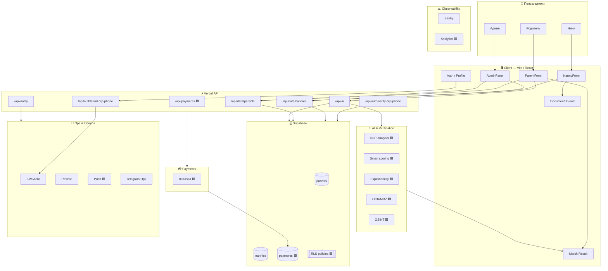

# 🏠 Blizko — Master Plan

> **Source of Truth** · Единый стратегический документ проекта
>
> Legend:  🟩 реализовано  ·  🟨 в процессе  ·  🟦 запланировано

---

## 1. North Star

> **Самый безопасный и предсказуемый сервис подбора нянь.**
>
> Мы продаём доверие, стабильность и объяснимость — не просто список нянь.

---

## 2. Architecture Decision

| Принцип | Решение |
|---------|---------|
| Приложение | Один backend + один frontend |
| Роли | Role-based routing + feature flags |
| Доступ | Guarded routes |
| Масштабирование | Нет второго nanny-приложения до PMF |

**Обоснование:** меньше tech debt, централизованный tracking, проще growth, быстрее итерации.

---

## 3. Execution Timeline

```
 Нед 1–2          Нед 3–4          Нед 5–6          Нед 7–8
┌──────────┐   ┌──────────┐   ┌──────────┐   ┌──────────┐
│  Первые  │──▶│ Платежи  │──▶│ UX-полиш │──▶│  App     │
│  сделки  │   │ ЮKassa   │   │ TestFlight│   │  Store   │
└──────────┘   └──────────┘   └──────────┘   └──────────┘
```

### Weeks 1–2 · Запуск сделок
- **Day 1–7:** верификация MVP, рекомендации, OSINT-hard, триаж 30–50 нянь, первые сделки
- **Day 8–14:** стабилизация воронки, фидбэк после визита, ядро 30–50 verified
- **Результат:** первые сделки + стабильная воронка

### Weeks 3–4 · Платежи и масштаб
- **Day 15–21:** ЮKassa (create payment + webhook + payments table)
- **Day 22–28:** 100+ нянь в пуле, регулярные сделки, улучшение SLA
- **Результат:** платежи в работе + устойчивый поток

### Weeks 5–6 · App Store readiness
- **Day 29–35:** финальный UX-полиш, удаление аккаунта/данных, privacy/terms
- **Day 36–42:** Capacitor wrapper + TestFlight (internal → external)
- **Результат:** TestFlight готов

### Weeks 7–8 · Релиз
- **Day 43–49:** App Store Connect, скриншоты, metadata
- **Day 50–56:** Review + релиз
- **Результат:** App Store релиз 🚀

---

## 4. AI Roadmap

| Фаза | Срок | Фокус |
|------|------|-------|
| **A** | 1–2 мес | NLP-анализ анкет (стиль, эмпатия, структура) · умный скоринг · авто-объяснимость матча |
| **B** | 2–3 мес | Видео-интервью + CV-сигналы · Risk-engine 2.0 · поведенческие микрокейсы |
| **C** | 3–4 мес | ML-ranking на фидбэке · персональные сценарии · предиктивный резерв |

---

## 5. Product Blocks

### 1️⃣ Качество базы
- Верификация документов (OCR/MRZ + face-match)
- Рекомендации (2 контакта)
- OSINT / правовой след + Trust-score 2

### 2️⃣ Совместимость (Mirror+ / PCM)
- Анкеты + поведенческие вопросы
- Объяснимый мэтчинг
- Фидбэк после визита

### 3️⃣ Стабильность / Гарантия прихода
- Soft-hold + приоритетные окна + двойной резерв
- Подтверждения T-24ч / T-3–4ч
- Календарь (родитель / няня / админ)

### 4️⃣ Платежи и экономика
- Комиссия с нянь
- Контроль выплат / стабильность

### 5️⃣ Операционный запуск
- Онбординг нянь
- Модерация
- Первый пул семей / нянь

### 6️⃣ Мобильная упаковка
- PWA / моб-UX
- Быстрые сценарии бронирования

---

## 6. System Architecture



---

## 7. Why & How — по блокам

| # | Блок | Зачем | Как |
|---|------|-------|-----|
| 1 | **Users** | Три роли → три потока ценности | Родитель (заявка/матч), няня (анкета/доки), админ (модерация) |
| 2 | **Client** | Быстрый MVP + контроль UX | ParentForm, NannyForm, Auth, Match, Docs, AdminPanel |
| 3 | **API** | Серверный контур | OTP → SMSAero, AI, data CRUD, notify, payments |
| 4 | **Supabase** | Хранение + безопасность | Таблицы parents / nannies / payments + RLS |
| 5 | **AI** | Отличаться качеством | NLP, скоринг, explainability, OCR, OSINT |
| 6 | **Ops** | Стабильность сделок | SMS, email, push (T-24ч / T-3ч), Telegram |
| 7 | **Observability** | Ловить ошибки + воронку | Sentry + product analytics |
| 8 | **Payments** | Закрепить экономику | ЮKassa (create + webhook) |
| 9 | **Roles** | У каждого блока — владелец | Product Lead, Ops Lead, Engineering, Legal, DPO |

---

## 8. Phase PMF — Nanny Role Mode

### Deliverables

| Зона | Задачи |
|------|--------|
| **Product** | Nanny funnel mapping · nanny dashboard · status states (applied → verified → matched) |
| **Tech** | Role-based routing · route guards · feature flags · event tracking |
| **Design** | Onboarding screens · nanny dashboard · status & error states |
| **Trust** | Verification state logic · abuse risk modelling · escalation triggers |
| **Ops** | Manual review process · SLA for nanny verification |
| **Growth** | Funnel metrics per stage · drop-off tracking |

### Event Tracking
```
nanny_registered → nanny_verified → nanny_profile_completed → nanny_matched → deal_done
```

### KPI

| Тип | Метрики |
|-----|---------|
| **Primary** | Onboarding completion % · verified nanny % · matched % · deal_done % |
| **Secondary** | Time to verification · drop-off per screen |

---

## 9. Services

### 🟩 Подключено
| Сервис | Назначение |
|--------|-----------|
| **Supabase** | DB / Auth / Storage — Postgres + RLS + auth |
| **Vercel** | API / Hosting — serverless деплой |
| **SMSAero** | OTP — SMS-верификация |
| **Resend** | Email — транзакционные письма |
| **Sentry** | Errors — мониторинг ошибок |
| **AI Provider** | Matching / Document — ядро дифференциации |

### 🟦 Подключаем
| Сервис | Назначение |
|--------|-----------|
| **ЮKassa** | Платежи — create + webhook |
| **OCR/MRZ + Face-match** | Усиление доверия, контроль базы |
| **OSINT checks** | Hard-фильтры безопасности |
| **Push notifications** | Снижение срывов (T-24ч / T-3ч) |
| **Product analytics** | Управление ростом и метриками |
